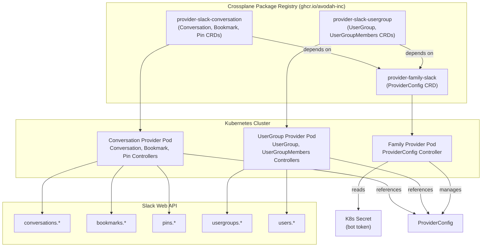
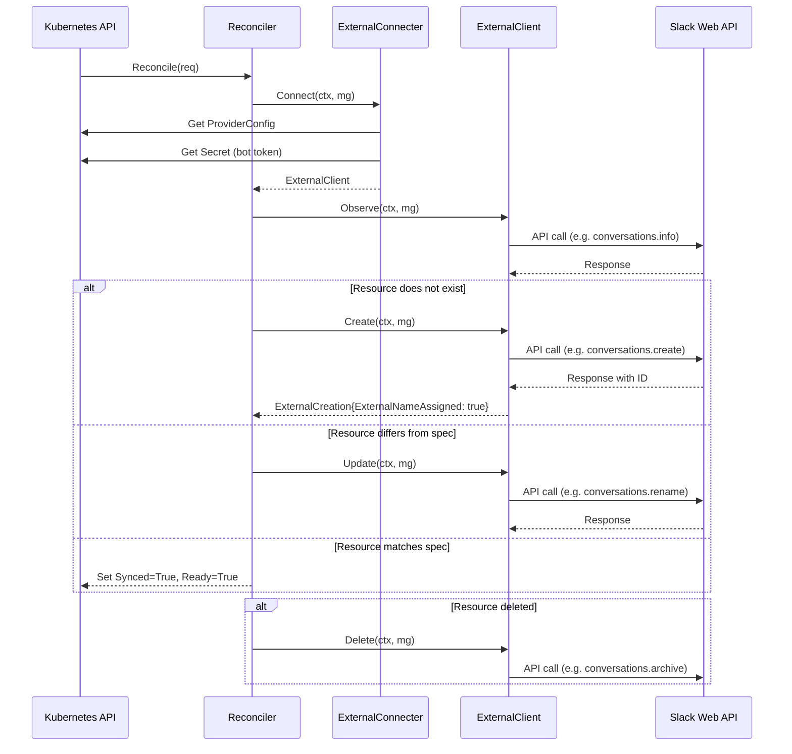
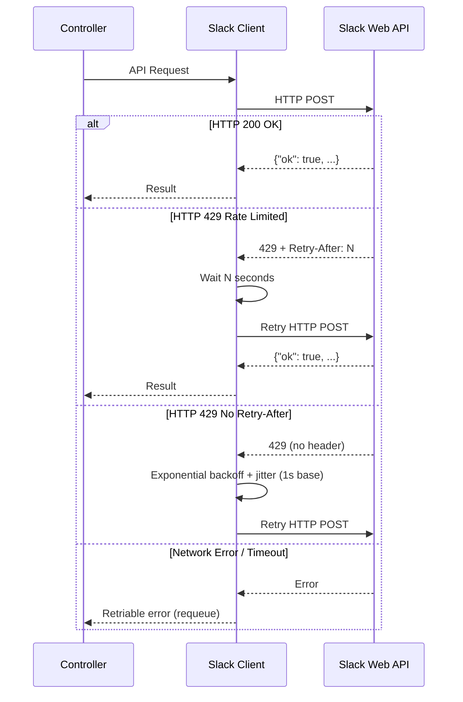

# Design Document: crossplane-provider-slack

## Overview

This document describes the technical design for a family-scoped native Crossplane provider that manages Slack workspace resources via the Slack Web API. The provider is structured as three independently installable Crossplane packages following Crossplane v2 best practices:

- `provider-family-slack` — owns the shared `ProviderConfig` CRD and credential management
- `provider-slack-conversation` — manages `Conversation`, `ConversationBookmark`, and `ConversationPin` resources
- `provider-slack-usergroup` — manages `UserGroup` and `UserGroupMembers` resources

The provider is written in Go, scaffolded from `crossplane/provider-template`, and uses `crossplane-runtime` v2 reconciler patterns (`managed.NewReconciler`, `ExternalConnecter`, `ExternalClient`). All managed resources support both cluster-scoped and namespaced (`.m` API group suffix) modes. The provider declares the `safe-start` capability so ManagedResourceDefinitions start as Inactive, requiring explicit activation via `ManagedResourceActivationPolicy`. Container images are distroless and run as non-root.

## Architecture

### Family-Scoped Provider Structure

The provider follows the Crossplane family provider pattern where a single repository produces multiple independently installable packages. The family provider owns shared configuration (ProviderConfig), and each family member declares a dependency on it.



### Reconciliation Flow

Each managed resource controller follows the standard `crossplane-runtime` reconciliation loop:



### Rate Limiting Flow



## Components and Interfaces

### Repository Structure

```
crossplane-provider-slack/
├── apis/
│   ├── generate.go                          # //go:generate angryjet directives
│   ├── v1alpha1/
│   │   ├── providerconfig_types.go          # ProviderConfig, ProviderConfigUsage
│   │   ├── groupversion_info.go             # SchemeBuilder for slack.crossplane.io
│   │   └── zz_generated.deepcopy.go         # Generated
│   ├── conversation/
│   │   └── v1alpha1/
│   │       ├── types.go                     # Conversation types
│   │       ├── groupversion_info.go
│   │       ├── referencers.go               # Cross-resource references
│   │       └── zz_generated.deepcopy.go
│   ├── bookmark/
│   │   └── v1alpha1/
│   │       ├── types.go                     # ConversationBookmark types
│   │       ├── groupversion_info.go
│   │       ├── referencers.go
│   │       └── zz_generated.deepcopy.go
│   ├── pin/
│   │   └── v1alpha1/
│   │       ├── types.go                     # ConversationPin types
│   │       ├── groupversion_info.go
│   │       ├── referencers.go
│   │       └── zz_generated.deepcopy.go
│   ├── usergroup/
│   │   └── v1alpha1/
│   │       ├── types.go                     # UserGroup types
│   │       ├── groupversion_info.go
│   │       └── zz_generated.deepcopy.go
│   └── usergroupmembers/
│       └── v1alpha1/
│           ├── types.go                     # UserGroupMembers types
│           ├── groupversion_info.go
│           ├── referencers.go
│           └── zz_generated.deepcopy.go
├── internal/
│   ├── clients/
│   │   └── slack/
│   │       ├── client.go                    # Slack HTTP client, auth, rate limiting
│   │       ├── client_test.go
│   │       ├── conversations.go             # conversations.* methods
│   │       ├── bookmarks.go                 # bookmarks.* methods
│   │       ├── pins.go                      # pins.* methods
│   │       ├── usergroups.go                # usergroups.* methods
│   │       ├── users.go                     # users.lookupByEmail
│   │       ├── errors.go                    # Structured Slack error types
│   │       └── ratelimit.go                 # Rate limit handling, backoff
│   ├── controller/
│   │   ├── conversation/
│   │   │   ├── conversation.go              # ExternalConnecter + ExternalClient
│   │   │   ├── conversation_test.go
│   │   │   └── setup.go                     # Setup + SetupGated
│   │   ├── bookmark/
│   │   │   ├── bookmark.go
│   │   │   ├── bookmark_test.go
│   │   │   └── setup.go
│   │   ├── pin/
│   │   │   ├── pin.go
│   │   │   ├── pin_test.go
│   │   │   └── setup.go
│   │   ├── usergroup/
│   │   │   ├── usergroup.go
│   │   │   ├── usergroup_test.go
│   │   │   └── setup.go
│   │   ├── usergroupmembers/
│   │   │   ├── usergroupmembers.go
│   │   │   ├── usergroupmembers_test.go
│   │   │   └── setup.go
│   │   └── providerconfig/
│   │       ├── providerconfig.go
│   │       └── setup.go
│   └── features/
│       └── features.go                      # Feature flags
├── cmd/
│   ├── family-provider/
│   │   └── main.go                          # Family provider entrypoint
│   ├── provider-conversation/
│   │   └── main.go                          # Conversation family member entrypoint
│   └── provider-usergroup/
│       └── main.go                          # UserGroup family member entrypoint
├── package/
│   ├── family/
│   │   ├── crossplane.yaml                  # Family provider package metadata
│   │   └── crds/                            # ProviderConfig CRD only
│   ├── conversation/
│   │   ├── crossplane.yaml                  # Conversation member metadata (depends on family)
│   │   └── crds/                            # Conversation, Bookmark, Pin CRDs
│   └── usergroup/
│       ├── crossplane.yaml                  # UserGroup member metadata (depends on family)
│       └── crds/                            # UserGroup, UserGroupMembers CRDs
├── Makefile
├── go.mod
├── go.sum
└── README.md
```

### Key Interfaces

Each controller implements the `crossplane-runtime` managed reconciler pattern:

```go
// ExternalConnecter — creates ExternalClient from ProviderConfig
type connector struct {
    kube   client.Client
    usage  resource.Tracker
    newFn  func(token string, opts ...slack.ClientOption) slack.ClientAPI
}

func (c *connector) Connect(ctx context.Context, mg resource.Managed) (managed.ExternalClient, error) {
    // 1. Track ProviderConfig usage
    // 2. Get ProviderConfig from spec.providerConfigRef
    // 3. Read bot token from referenced Secret
    // 4. Validate token format (xoxb- prefix)
    // 5. Return ExternalClient wrapping Slack client
}

// ExternalClient — CRUD operations against Slack API
type external struct {
    client slack.ClientAPI
}

func (e *external) Observe(ctx context.Context, mg resource.Managed) (managed.ExternalObservation, error) { ... }
func (e *external) Create(ctx context.Context, mg resource.Managed) (managed.ExternalCreation, error) { ... }
func (e *external) Update(ctx context.Context, mg resource.Managed) (managed.ExternalUpdate, error) { ... }
func (e *external) Delete(ctx context.Context, mg resource.Managed) (managed.ExternalDeletion, error) { ... }
```

### Slack Client Interface

The Slack client is defined as an interface to enable testing with mocks:

```go
// ClientAPI defines the Slack Web API operations used by controllers.
type ClientAPI interface {
    // Conversations
    CreateConversation(ctx context.Context, name string, isPrivate bool) (*Conversation, error)
    GetConversationInfo(ctx context.Context, channelID string) (*Conversation, error)
    RenameConversation(ctx context.Context, channelID, name string) error
    SetConversationTopic(ctx context.Context, channelID, topic string) error
    SetConversationPurpose(ctx context.Context, channelID, purpose string) error
    ArchiveConversation(ctx context.Context, channelID string) error

    // Bookmarks
    AddBookmark(ctx context.Context, channelID string, params BookmarkParams) (*Bookmark, error)
    ListBookmarks(ctx context.Context, channelID string) ([]Bookmark, error)
    EditBookmark(ctx context.Context, channelID, bookmarkID string, params BookmarkParams) error
    RemoveBookmark(ctx context.Context, channelID, bookmarkID string) error

    // Pins
    AddPin(ctx context.Context, channelID, messageTS string) error
    ListPins(ctx context.Context, channelID string) ([]Pin, error)
    RemovePin(ctx context.Context, channelID, messageTS string) error

    // User Groups
    CreateUserGroup(ctx context.Context, params UserGroupParams) (*UserGroup, error)
    ListUserGroups(ctx context.Context) ([]UserGroup, error)
    UpdateUserGroup(ctx context.Context, groupID string, params UserGroupParams) error
    DisableUserGroup(ctx context.Context, groupID string) error

    // User Group Members
    ListUserGroupMembers(ctx context.Context, groupID string) ([]string, error)
    UpdateUserGroupMembers(ctx context.Context, groupID string, userIDs []string) error

    // Users
    LookupUserByEmail(ctx context.Context, email string) (*User, error)
}
```

### Slack Client Implementation

```go
type Client struct {
    httpClient *http.Client
    token      string
    baseURL    string // default: "https://slack.com/api"
}

// Do executes an API call with rate-limit handling.
func (c *Client) Do(ctx context.Context, method string, params url.Values) (*http.Response, error) {
    // 1. Build request with Authorization: Bearer <token>
    // 2. Execute with 30s timeout
    // 3. On 429: read Retry-After, wait, retry
    // 4. On 429 without Retry-After: exponential backoff with jitter (1s base)
    // 5. On network error: return retriable error
    // 6. On {"ok": false}: return structured SlackError
}
```

### Package Metadata

Each family member's `crossplane.yaml` declares a dependency on the family provider:

```yaml
# package/conversation/crossplane.yaml
apiVersion: meta.pkg.crossplane.io/v1
kind: Provider
metadata:
  name: provider-slack-conversation
spec:
  crossplane:
    version: ">=v2.0.0"
  capabilities:
    - safe-start
  dependsOn:
    - provider: ghcr.io/avodah-inc/provider-family-slack
      version: ">=v0.1.0"
```

## Data Models

### ProviderConfig (owned by provider-family-slack)

```go
package v1alpha1

import (
    xpv1 "github.com/crossplane/crossplane-runtime/apis/common/v1"
    metav1 "k8s.io/apimachinery/pkg/apis/meta/v1"
)

// +kubebuilder:object:root=true
// +kubebuilder:resource:scope=Cluster,categories={crossplane,provider,slack}
// +kubebuilder:printcolumn:name="AGE",type="date",JSONPath=".metadata.creationTimestamp"
// +kubebuilder:printcolumn:name="READY",type="string",JSONPath=".status.conditions[?(@.type=='Ready')].status"
// +kubebuilder:subresource:status
type ProviderConfig struct {
    metav1.TypeMeta   `json:",inline"`
    metav1.ObjectMeta `json:"metadata,omitempty"`
    Spec              ProviderConfigSpec   `json:"spec"`
    Status            ProviderConfigStatus `json:"status,omitempty"`
}

type ProviderConfigSpec struct {
    xpv1.ProviderConfigSpec `json:",inline"`

    // PollInterval configures the reconciliation poll interval for all
    // managed resources referencing this ProviderConfig.
    // Default: "5m"
    // +optional
    // +kubebuilder:default="5m"
    PollInterval *metav1.Duration `json:"pollInterval,omitempty"`
}

type ProviderConfigStatus struct {
    xpv1.ProviderConfigStatus `json:",inline"`
}

// +kubebuilder:object:root=true
type ProviderConfigList struct {
    metav1.TypeMeta `json:",inline"`
    metav1.ListMeta `json:"metadata,omitempty"`
    Items           []ProviderConfig `json:"items"`
}

// +kubebuilder:object:root=true
// +kubebuilder:resource:scope=Cluster,categories={crossplane,provider,slack}
type ProviderConfigUsage struct {
    metav1.TypeMeta   `json:",inline"`
    metav1.ObjectMeta `json:"metadata,omitempty"`
    xpv1.ProviderConfigUsage `json:",inline"`
}

// +kubebuilder:object:root=true
type ProviderConfigUsageList struct {
    metav1.TypeMeta `json:",inline"`
    metav1.ListMeta `json:"metadata,omitempty"`
    Items           []ProviderConfigUsage `json:"items"`
}
```

### Conversation

```go
package v1alpha1

import (
    xpv1 "github.com/crossplane/crossplane-runtime/apis/common/v1"
    metav1 "k8s.io/apimachinery/pkg/apis/meta/v1"
)

// +kubebuilder:object:root=true
// +kubebuilder:resource:scope=Cluster,categories={crossplane,managed,slack}
// +kubebuilder:printcolumn:name="READY",type="string",JSONPath=".status.conditions[?(@.type=='Ready')].status"
// +kubebuilder:printcolumn:name="SYNCED",type="string",JSONPath=".status.conditions[?(@.type=='Synced')].status"
// +kubebuilder:printcolumn:name="EXTERNAL-NAME",type="string",JSONPath=".metadata.annotations.crossplane\\.io/external-name"
// +kubebuilder:printcolumn:name="AGE",type="date",JSONPath=".metadata.creationTimestamp"
// +kubebuilder:subresource:status
type Conversation struct {
    metav1.TypeMeta   `json:",inline"`
    metav1.ObjectMeta `json:"metadata,omitempty"`
    Spec              ConversationSpec   `json:"spec"`
    Status            ConversationStatus `json:"status,omitempty"`
}

type ConversationSpec struct {
    xpv1.ResourceSpec `json:",inline"`
    ForProvider       ConversationParameters `json:"forProvider"`
}

type ConversationParameters struct {
    // Name is the channel name. Required.
    // +kubebuilder:validation:Required
    // +kubebuilder:validation:MinLength=1
    // +kubebuilder:validation:MaxLength=80
    Name string `json:"name"`

    // IsPrivate determines if the channel is private. Default: false.
    // +optional
    // +kubebuilder:default=false
    IsPrivate *bool `json:"isPrivate,omitempty"`

    // Topic is the channel topic.
    // +optional
    // +kubebuilder:validation:MaxLength=250
    Topic *string `json:"topic,omitempty"`

    // Purpose is the channel purpose.
    // +optional
    // +kubebuilder:validation:MaxLength=250
    Purpose *string `json:"purpose,omitempty"`
}

type ConversationStatus struct {
    xpv1.ResourceStatus `json:",inline"`
    AtProvider          ConversationObservation `json:"atProvider,omitempty"`
}

type ConversationObservation struct {
    // ID is the Slack channel ID.
    ID string `json:"id,omitempty"`

    // IsArchived indicates whether the channel is archived.
    IsArchived bool `json:"isArchived,omitempty"`

    // NumMembers is the number of members in the channel.
    NumMembers int `json:"numMembers,omitempty"`

    // Created is the Unix timestamp of channel creation.
    Created int64 `json:"created,omitempty"`
}

// +kubebuilder:object:root=true
type ConversationList struct {
    metav1.TypeMeta `json:",inline"`
    metav1.ListMeta `json:"metadata,omitempty"`
    Items           []Conversation `json:"items"`
}
```

### ConversationBookmark

```go
package v1alpha1

import (
    xpv1 "github.com/crossplane/crossplane-runtime/apis/common/v1"
    metav1 "k8s.io/apimachinery/pkg/apis/meta/v1"
)

// +kubebuilder:object:root=true
// +kubebuilder:resource:scope=Cluster,categories={crossplane,managed,slack}
// +kubebuilder:printcolumn:name="READY",type="string",JSONPath=".status.conditions[?(@.type=='Ready')].status"
// +kubebuilder:printcolumn:name="SYNCED",type="string",JSONPath=".status.conditions[?(@.type=='Synced')].status"
// +kubebuilder:printcolumn:name="EXTERNAL-NAME",type="string",JSONPath=".metadata.annotations.crossplane\\.io/external-name"
// +kubebuilder:printcolumn:name="AGE",type="date",JSONPath=".metadata.creationTimestamp"
// +kubebuilder:subresource:status
type ConversationBookmark struct {
    metav1.TypeMeta   `json:",inline"`
    metav1.ObjectMeta `json:"metadata,omitempty"`
    Spec              ConversationBookmarkSpec   `json:"spec"`
    Status            ConversationBookmarkStatus `json:"status,omitempty"`
}

type ConversationBookmarkSpec struct {
    xpv1.ResourceSpec `json:",inline"`
    ForProvider       ConversationBookmarkParameters `json:"forProvider"`
}

type ConversationBookmarkParameters struct {
    // ConversationID is the raw Slack channel ID. One of ConversationID or
    // ConversationRef is required.
    // +optional
    ConversationID *string `json:"conversationId,omitempty"`

    // ConversationRef references a Conversation resource to resolve the channel ID.
    // +optional
    ConversationRef *xpv1.Reference `json:"conversationRef,omitempty"`

    // ConversationSelector selects a Conversation resource.
    // +optional
    ConversationSelector *xpv1.Selector `json:"conversationSelector,omitempty"`

    // Title is the bookmark display title. Required.
    // +kubebuilder:validation:Required
    Title string `json:"title"`

    // Type is the bookmark type. Currently only "link" is supported.
    // +kubebuilder:validation:Required
    // +kubebuilder:validation:Enum=link
    Type string `json:"type"`

    // Link is the bookmark URL. Required.
    // +kubebuilder:validation:Required
    // +kubebuilder:validation:Format=uri
    Link string `json:"link"`
}

type ConversationBookmarkStatus struct {
    xpv1.ResourceStatus `json:",inline"`
    AtProvider          ConversationBookmarkObservation `json:"atProvider,omitempty"`
}

type ConversationBookmarkObservation struct {
    ID          string `json:"id,omitempty"`
    ChannelID   string `json:"channelId,omitempty"`
    DateCreated int64  `json:"dateCreated,omitempty"`
}

// +kubebuilder:object:root=true
type ConversationBookmarkList struct {
    metav1.TypeMeta `json:",inline"`
    metav1.ListMeta `json:"metadata,omitempty"`
    Items           []ConversationBookmark `json:"items"`
}
```

### ConversationPin

```go
package v1alpha1

import (
    xpv1 "github.com/crossplane/crossplane-runtime/apis/common/v1"
    metav1 "k8s.io/apimachinery/pkg/apis/meta/v1"
)

// +kubebuilder:object:root=true
// +kubebuilder:resource:scope=Cluster,categories={crossplane,managed,slack}
// +kubebuilder:printcolumn:name="READY",type="string",JSONPath=".status.conditions[?(@.type=='Ready')].status"
// +kubebuilder:printcolumn:name="SYNCED",type="string",JSONPath=".status.conditions[?(@.type=='Synced')].status"
// +kubebuilder:printcolumn:name="AGE",type="date",JSONPath=".metadata.creationTimestamp"
// +kubebuilder:subresource:status
type ConversationPin struct {
    metav1.TypeMeta   `json:",inline"`
    metav1.ObjectMeta `json:"metadata,omitempty"`
    Spec              ConversationPinSpec   `json:"spec"`
    Status            ConversationPinStatus `json:"status,omitempty"`
}

type ConversationPinSpec struct {
    xpv1.ResourceSpec `json:",inline"`
    ForProvider       ConversationPinParameters `json:"forProvider"`
}

type ConversationPinParameters struct {
    // ConversationID is the raw Slack channel ID.
    // +optional
    ConversationID *string `json:"conversationId,omitempty"`

    // ConversationRef references a Conversation resource.
    // +optional
    ConversationRef *xpv1.Reference `json:"conversationRef,omitempty"`

    // ConversationSelector selects a Conversation resource.
    // +optional
    ConversationSelector *xpv1.Selector `json:"conversationSelector,omitempty"`

    // MessageTimestamp is the Slack message `ts` value to pin.
    // +kubebuilder:validation:Required
    // +kubebuilder:validation:Pattern=`^\d+\.\d+$`
    MessageTimestamp string `json:"messageTimestamp"`
}

type ConversationPinStatus struct {
    xpv1.ResourceStatus `json:",inline"`
    AtProvider          ConversationPinObservation `json:"atProvider,omitempty"`
}

type ConversationPinObservation struct {
    ChannelID string `json:"channelId,omitempty"`
    PinnedAt  int64  `json:"pinnedAt,omitempty"`
}

// +kubebuilder:object:root=true
type ConversationPinList struct {
    metav1.TypeMeta `json:",inline"`
    metav1.ListMeta `json:"metadata,omitempty"`
    Items           []ConversationPin `json:"items"`
}
```

### UserGroup

```go
package v1alpha1

import (
    xpv1 "github.com/crossplane/crossplane-runtime/apis/common/v1"
    metav1 "k8s.io/apimachinery/pkg/apis/meta/v1"
)

// +kubebuilder:object:root=true
// +kubebuilder:resource:scope=Cluster,categories={crossplane,managed,slack}
// +kubebuilder:printcolumn:name="READY",type="string",JSONPath=".status.conditions[?(@.type=='Ready')].status"
// +kubebuilder:printcolumn:name="SYNCED",type="string",JSONPath=".status.conditions[?(@.type=='Synced')].status"
// +kubebuilder:printcolumn:name="EXTERNAL-NAME",type="string",JSONPath=".metadata.annotations.crossplane\\.io/external-name"
// +kubebuilder:printcolumn:name="AGE",type="date",JSONPath=".metadata.creationTimestamp"
// +kubebuilder:subresource:status
type UserGroup struct {
    metav1.TypeMeta   `json:",inline"`
    metav1.ObjectMeta `json:"metadata,omitempty"`
    Spec              UserGroupSpec   `json:"spec"`
    Status            UserGroupStatus `json:"status,omitempty"`
}

type UserGroupSpec struct {
    xpv1.ResourceSpec `json:",inline"`
    ForProvider       UserGroupParameters `json:"forProvider"`
}

type UserGroupParameters struct {
    // Name is the user group display name. Required.
    // +kubebuilder:validation:Required
    Name string `json:"name"`

    // Handle is the mention handle (without @). Required.
    // +kubebuilder:validation:Required
    // +kubebuilder:validation:Pattern=`^[a-z0-9][a-z0-9._-]*$`
    Handle string `json:"handle"`

    // Description is an optional description of the user group.
    // +optional
    Description *string `json:"description,omitempty"`
}

type UserGroupStatus struct {
    xpv1.ResourceStatus `json:",inline"`
    AtProvider          UserGroupObservation `json:"atProvider,omitempty"`
}

type UserGroupObservation struct {
    ID         string `json:"id,omitempty"`
    IsEnabled  bool   `json:"isEnabled,omitempty"`
    CreatedBy  string `json:"createdBy,omitempty"`
    DateCreate int64  `json:"dateCreate,omitempty"`
}

// +kubebuilder:object:root=true
type UserGroupList struct {
    metav1.TypeMeta `json:",inline"`
    metav1.ListMeta `json:"metadata,omitempty"`
    Items           []UserGroup `json:"items"`
}
```

### UserGroupMembers

```go
package v1alpha1

import (
    xpv1 "github.com/crossplane/crossplane-runtime/apis/common/v1"
    metav1 "k8s.io/apimachinery/pkg/apis/meta/v1"
)

// +kubebuilder:object:root=true
// +kubebuilder:resource:scope=Cluster,categories={crossplane,managed,slack}
// +kubebuilder:printcolumn:name="READY",type="string",JSONPath=".status.conditions[?(@.type=='Ready')].status"
// +kubebuilder:printcolumn:name="SYNCED",type="string",JSONPath=".status.conditions[?(@.type=='Synced')].status"
// +kubebuilder:printcolumn:name="AGE",type="date",JSONPath=".metadata.creationTimestamp"
// +kubebuilder:subresource:status
type UserGroupMembers struct {
    metav1.TypeMeta   `json:",inline"`
    metav1.ObjectMeta `json:"metadata,omitempty"`
    Spec              UserGroupMembersSpec   `json:"spec"`
    Status            UserGroupMembersStatus `json:"status,omitempty"`
}

type UserGroupMembersSpec struct {
    xpv1.ResourceSpec `json:",inline"`
    ForProvider       UserGroupMembersParameters `json:"forProvider"`
}

type UserGroupMembersParameters struct {
    // UserGroupID is the raw Slack usergroup ID.
    // +optional
    UserGroupID *string `json:"userGroupId,omitempty"`

    // UserGroupRef references a UserGroup resource.
    // +optional
    UserGroupRef *xpv1.Reference `json:"userGroupRef,omitempty"`

    // UserGroupSelector selects a UserGroup resource.
    // +optional
    UserGroupSelector *xpv1.Selector `json:"userGroupSelector,omitempty"`

    // UserEmails is the list of user email addresses to resolve to Slack user IDs.
    // +kubebuilder:validation:Required
    // +kubebuilder:validation:MinItems=1
    UserEmails []string `json:"userEmails"`
}

type UserGroupMembersStatus struct {
    xpv1.ResourceStatus `json:",inline"`
    AtProvider          UserGroupMembersObservation `json:"atProvider,omitempty"`
}

type UserGroupMembersObservation struct {
    // ResolvedUserIDs is the list of Slack user IDs resolved from emails.
    ResolvedUserIDs []string `json:"resolvedUserIds,omitempty"`

    // MemberCount is the number of members in the group.
    MemberCount int `json:"memberCount,omitempty"`
}

// +kubebuilder:object:root=true
type UserGroupMembersList struct {
    metav1.TypeMeta `json:",inline"`
    metav1.ListMeta `json:"metadata,omitempty"`
    Items           []UserGroupMembers `json:"items"`
}
```

### Slack Client Data Types

```go
package slack

// SlackError represents a structured error from the Slack API.
type SlackError struct {
    Code    string // e.g. "name_taken", "channel_not_found"
    Message string // Human-readable message
}

func (e *SlackError) Error() string { return fmt.Sprintf("slack: %s: %s", e.Code, e.Message) }

// IsRetriable returns true if the error is transient and the operation should be retried.
func (e *SlackError) IsRetriable() bool {
    switch e.Code {
    case "internal_error", "fatal_error", "request_timeout":
        return true
    default:
        return false
    }
}

// Conversation represents a Slack channel.
type Conversation struct {
    ID         string `json:"id"`
    Name       string `json:"name"`
    IsPrivate  bool   `json:"is_private"`
    IsArchived bool   `json:"is_archived"`
    Topic      Topic  `json:"topic"`
    Purpose    Topic  `json:"purpose"`
    NumMembers int    `json:"num_members"`
    Created    int64  `json:"created"`
}

type Topic struct {
    Value string `json:"value"`
}

// Bookmark represents a Slack channel bookmark.
type Bookmark struct {
    ID          string `json:"id"`
    ChannelID   string `json:"channel_id"`
    Title       string `json:"title"`
    Type        string `json:"type"`
    Link        string `json:"link"`
    DateCreated int64  `json:"date_created"`
}

type BookmarkParams struct {
    Title string
    Type  string
    Link  string
}

// Pin represents a pinned item in a Slack channel.
type Pin struct {
    Channel   string  `json:"channel"`
    Message   Message `json:"message"`
    Created   int64   `json:"created"`
}

type Message struct {
    Ts string `json:"ts"`
}

// UserGroup represents a Slack user group.
type UserGroup struct {
    ID          string `json:"id"`
    Name        string `json:"name"`
    Handle      string `json:"handle"`
    Description string `json:"description"`
    IsEnabled   bool   `json:"is_usergroup"` // Slack API field name
    CreatedBy   string `json:"created_by"`
    DateCreate  int64  `json:"date_create"`
}

type UserGroupParams struct {
    Name        string
    Handle      string
    Description string
}

// User represents a Slack user (subset of fields).
type User struct {
    ID      string       `json:"id"`
    Profile UserProfile  `json:"profile"`
}

type UserProfile struct {
    Email string `json:"email"`
}
```

## Correctness Properties

*A property is a characteristic or behavior that should hold true across all valid executions of a system — essentially, a formal statement about what the system should do. Properties serve as the bridge between human-readable specifications and machine-verifiable correctness guarantees.*

### Property 1: Bot token validation accepts only xoxb- prefixed strings

*For any* string value, the token validator SHALL accept it if and only if it starts with the `xoxb-` prefix. All other strings (empty, whitespace-only, wrong prefix) SHALL be rejected with `InvalidCredentials`.

**Validates: Requirements 1.4, 1.5**

### Property 2: Every Slack API request includes the Authorization header

*For any* Slack API call made through the client, the HTTP request SHALL include an `Authorization: Bearer <token>` header where `<token>` is the bot token provided at client construction time.

**Validates: Requirements 2.1**

### Property 3: Rate-limited responses with Retry-After are retried after the specified duration

*For any* Slack API call that receives an HTTP 429 response with a `Retry-After: N` header, the client SHALL wait at least N seconds before retrying the request.

**Validates: Requirements 2.2**

### Property 4: Exponential backoff with jitter produces bounded delays

*For any* retry attempt number N (starting from 0), the backoff duration SHALL be within the range `[0, min(2^N * baseDelay, maxDelay))` where baseDelay is 1 second. The jitter component SHALL ensure that two concurrent backoff calculations for the same attempt number produce different wait times with high probability.

**Validates: Requirements 2.3**

### Property 5: Slack API error responses are parsed into structured errors

*For any* Slack API response with `"ok": false` and an `"error"` field, the client SHALL return a `SlackError` whose `Code` field matches the `"error"` value from the response body.

**Validates: Requirements 2.4**

### Property 6: Serialized managed resources never contain credential values

*For any* ProviderConfig or managed resource object and any bot token value, serializing the object to JSON SHALL NOT produce output containing the bot token string.

**Validates: Requirements 1.7, 10.4**

### Property 7: Create stores the Slack-returned ID as external-name

*For any* managed resource kind (Conversation, ConversationBookmark, UserGroup) and valid `forProvider` parameters, calling Create SHALL invoke the corresponding Slack API create method and set the `crossplane.io/external-name` annotation to the identifier returned by the API.

**Validates: Requirements 3.4, 4.4, 6.4, 8.3**

### Property 8: Observe correctly detects state drift between desired and remote

*For any* managed resource with an external-name and any combination of desired spec fields and remote state fields, Observe SHALL return `ResourceUpToDate: true` if and only if all comparable fields match, and `ResourceUpToDate: false` otherwise.

**Validates: Requirements 3.5, 4.5, 5.5, 6.5, 7.7**

### Property 9: Conversation Update dispatches the correct API call for each changed field

*For any* Conversation resource where the desired spec differs from the observed remote state, Update SHALL call `conversations.rename` if the name differs, `conversations.setTopic` if the topic differs, and `conversations.setPurpose` if the purpose differs. Only the API methods for changed fields SHALL be called.

**Validates: Requirements 3.6, 3.7, 3.8**

### Property 10: Bookmark Update dispatches edit for changed title or link

*For any* ConversationBookmark resource where the desired title or link differs from the observed remote values, Update SHALL call `bookmarks.edit` with the updated fields.

**Validates: Requirements 4.6**

### Property 11: UserGroup Update dispatches update for changed name, handle, or description

*For any* UserGroup resource where the desired name, handle, or description differs from the observed remote values, Update SHALL call `usergroups.update` with the updated fields.

**Validates: Requirements 6.6**

### Property 12: Email resolution produces correct user ID list for membership update

*For any* list of valid email addresses and a mock `users.lookupByEmail` mapping, the UserGroupMembers controller SHALL resolve all emails to user IDs and call `usergroups.users.update` with exactly the set of resolved IDs.

**Validates: Requirements 7.4, 7.6**

### Property 13: Unresolvable emails are reported with UserNotFound

*For any* list of email addresses containing at least one email that cannot be resolved, the UserGroupMembers controller SHALL set the resource condition to `Synced=False` with reason `UserNotFound` and the status message SHALL contain the unresolvable email address.

**Validates: Requirements 7.5**

### Property 14: Member set comparison is order-independent

*For any* two lists of Slack user IDs representing the desired and current membership, Observe SHALL report them as equal if and only if they contain the same set of IDs, regardless of ordering.

**Validates: Requirements 7.7**

### Property 15: Configurable poll interval is respected

*For any* valid Go duration string set in `ProviderConfig.spec.pollInterval`, the reconciler SHALL use the parsed duration as the poll interval for managed resources referencing that ProviderConfig.

**Validates: Requirements 8.2**

## Error Handling

### Slack API Errors

Each controller maps Slack API error codes to Crossplane resource conditions:

| Slack Error Code | Condition | Reason | Affected Resources |
| --- | --- | --- | --- |
| `name_taken` | `Synced=False` | `NameConflict` | Conversation |
| `name_already_exists` | `Synced=False` | `NameConflict` | UserGroup |
| `channel_not_found` | `Synced=False` | `NotFound` | Conversation |
| `channel_not_found` | `Synced=False` | `ChannelUnavailable` | ConversationBookmark, ConversationPin |
| `is_archived` | `Synced=False` | `ChannelUnavailable` | ConversationBookmark, ConversationPin |
| `message_not_found` | `Synced=False` | `MessageNotFound` | ConversationPin |
| `users_not_found` | `Synced=False` | `UserNotFound` | UserGroupMembers |
| `internal_error`, `fatal_error`, `request_timeout` | Requeue | (retriable) | All |

### ProviderConfig Errors

| Condition | Reason | Trigger |
| --- | --- | --- |
| `Ready=False` | `SecretNotFound` | Referenced Kubernetes Secret does not exist |
| `Ready=False` | `InvalidCredentials` | Bot token is empty or missing `xoxb-` prefix |
| `Ready=True` | — | Valid bot token loaded |

### Network and Timeout Errors

- HTTP client timeout (30s): returned as retriable error, resource requeued
- Connection refused / DNS failure: returned as retriable error, resource requeued
- HTTP 429 with `Retry-After`: client waits and retries transparently
- HTTP 429 without `Retry-After`: exponential backoff with jitter (1s base, capped at 60s)
- Maximum 3 retries per reconciliation cycle for rate-limited requests

### Error Wrapping

All errors returned from the Slack client are wrapped with `errors.Wrap` from `crossplane-runtime` to preserve the error chain for debugging:

```go
if err != nil {
    return managed.ExternalObservation{}, errors.Wrap(err, "cannot get conversation info")
}
```

## Testing Strategy

### Unit Tests

Unit tests cover specific examples, edge cases, and error conditions using mock implementations of the `ClientAPI` interface:

- Connector tests: secret retrieval, token validation, error paths
- ExternalClient tests per resource: Observe/Create/Update/Delete with mock Slack client
- Slack client tests: HTTP request construction, response parsing, error mapping
- Rate limiter tests: backoff calculation, Retry-After parsing
- Error condition tests: each Slack error code mapped to the correct Crossplane condition

### Property-Based Tests

Property-based tests use [rapid](https://github.com/flyingmutant/rapid) (Go PBT library) to verify universal properties across generated inputs. Each property test runs a minimum of 100 iterations.

Configuration:

- Library: `pgregory.net/rapid`
- Minimum iterations: 100 per property
- Each test is tagged with a comment referencing the design property

Tag format: `// Feature: crossplane-provider-slack, Property N: <property text>`

Properties to implement:

1. Token validation (Property 1)
2. Authorization header inclusion (Property 2)
3. Retry-After compliance (Property 3)
4. Backoff bounds (Property 4)
5. Error parsing (Property 5)
6. Credential exclusion from serialization (Property 6)
7. External-name assignment on Create (Property 7)
8. State drift detection in Observe (Property 8)
9. Conversation Update dispatch (Property 9)
10. Bookmark Update dispatch (Property 10)
11. UserGroup Update dispatch (Property 11)
12. Email resolution correctness (Property 12)
13. Unresolvable email reporting (Property 13)
14. Order-independent member set comparison (Property 14)
15. Poll interval configuration (Property 15)

### Integration Tests

Integration tests run against a real Crossplane v2 cluster (kind-based) with a mock Slack API server:

- Provider installation and dependency resolution
- MRD creation and activation via ManagedResourceActivationPolicy
- End-to-end reconciliation for each managed resource kind
- CRD validation with kubeconform
- Build system targets (`make generate`, `make build`, `make xpkg-build`)

### Security Tests

- Trivy filesystem scan: zero critical/high/medium vulnerabilities
- Container image scan: distroless base, non-root user
- Credential leak check: bot token never appears in logs, events, or serialized objects
